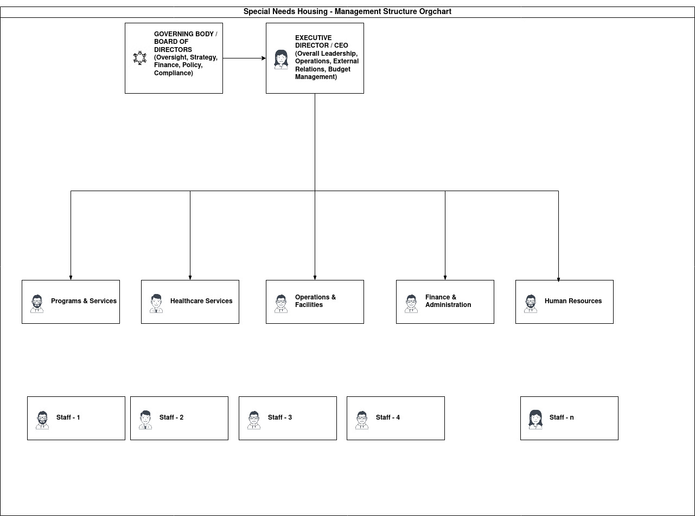

# 
 Management Staffing 

## Requirements for a Self-Sustaining, Lifelong Community Living Model for Young Autistic Adults Including End-of-Life Care

Establishing a self-sustaining community living model for young autistic adults that provides support throughout their lives, including end-of-life care, necessitates a robust and dynamic management structure and a highly skilled and adaptable staffing model. This model must prioritize individualized support, promote independence where possible, foster a strong sense of community, and ensure seamless access to healthcare, including specialized palliative and hospice care as residents age and their needs change.

**Key Principles Guiding Structure and Staffing:**

* **Person-Centered Planning:** The foundation of the model must be individualized support plans developed with each resident, their family (as appropriate), and their support network. These plans should be reviewed and updated regularly to reflect changing needs, preferences, and goals across the lifespan.
* **Neurodiversity Affirming Approach:** The environment and support should be tailored to the unique sensory, communication, and social processing differences of autistic individuals.
* **Emphasis on Independence and Skill Development:** Support should be designed to promote the highest possible level of independence and continued skill development throughout adulthood.
* **Community Integration:** The model should foster meaningful connections within the residential community and facilitate participation in the wider local community.
* **Dignity of Risk:** While ensuring safety, the model should support individuals in making choices and taking reasonable risks to enhance their lives.
* **Seamless Continuum of Care:** The structure must ensure that residents receive appropriate support as their needs evolve, from young adulthood through aging and end-of-life.
* **Financial Sustainability:** The model needs a long-term financial plan that reduces reliance on volatile funding sources.

### Management Structure Requirements:

A successful self-sustaining model requires a multi-layered management structure with clear responsibilities and strong communication channels.

1.  **Governing Body/Board of Directors:**
    * **Composition:** Should include individuals with expertise in autism, developmental disabilities, healthcare (including geriatrics and palliative care), finance, law, non-profit management, and ideally, include autistic individuals and family members.
    * **Responsibilities:** Strategic planning, financial oversight, fundraising and development, policy setting, ensuring legal and ethical compliance (including end-of-life care directives and capacity issues), and overall accountability for the well-being of the residents.

2.  **Executive Director/CEO:**
    * **Qualifications:** Strong leadership and management skills, experience in residential care or services for individuals with developmental disabilities, understanding of autism-specific needs, financial acumen, and experience in fundraising and community relations.
    * **Responsibilities:** Overseeing daily operations, implementing policies set by the governing body, managing the budget, leading the management team, external representation, and ensuring the quality of care and services.

3.  **Leadership Team:**
    * **Composition:** Heads of key departments such as Programs and Services, Healthcare Services, Operations and Facilities, and Finance and Administration.
    * **Responsibilities:** Strategic planning within their respective areas, staff supervision and development, program development and implementation, quality assurance, and inter-departmental coordination.

4.  **Program and Services Management:**
    * **Manager:** Oversees the development and delivery of individualized support plans, life skills training, social and recreational activities, employment and vocational support, and community integration initiatives. Requires expertise in autism-specific interventions and person-centered planning.

5.  **Healthcare Services Management:**
    * **Director of Healthcare Services:** A registered nurse or other qualified healthcare professional with experience in managing care for individuals with developmental disabilities and a strong understanding of aging and palliative care needs.
    * **Responsibilities:** Overseeing all healthcare aspects, including coordinating medical appointments, medication management, managing chronic conditions, developing healthcare protocols, liaising with external medical professionals and hospice providers, and ensuring staff training in healthcare support and end-of-life care.

6.  **Operations and Facilities Management:**
    * **Manager:** Responsible for the physical infrastructure, maintenance, safety and security, transportation, and procurement. Needs to ensure the environment remains suitable and adaptable to the changing needs of residents, including accessibility for mobility issues and the provision of a calm and sensory-friendly atmosphere.

7.  **Finance and Administration Management:**
    * **Manager:** Oversees budgeting, accounting, payroll, billing (including navigating complex funding streams like waivers and private pay), financial reporting, and human resources. Crucial for ensuring the self-sustainability of the model through effective financial planning and management, potentially including the oversight of social enterprises or other revenue-generating activities.

8.  **Human Resources:**
    * **Manager:** Responsible for recruitment, hiring, training, staff retention, performance management, and ensuring compliance with labor laws. Critical for recruiting and retaining qualified staff with expertise in autism and complex care needs.

### Staffing Needs:

The staffing model must be flexible, highly trained, and sufficient in number to meet the diverse and evolving needs of young autistic adults, including increasing support requirements with aging and dedicated end-of-life care. A multi-disciplinary team approach is essential.

1.  **Direct Support Professionals (DSPs):**
    * **Role:** Provide direct daily support to residents based on their individualized plans, including assistance with personal care, daily living skills, meal preparation, medication reminders and administration (with appropriate training and certification), community outings, and social engagement.
    * **Qualifications:** Experience working with individuals with autism and/or developmental disabilities. Training in autism-specific strategies (e.g., positive behavior support, communication techniques, sensory sensitivities), person-centered active support, emergency procedures, and basic health monitoring.
    * **Ratios:** Ratios will vary significantly based on the residents' level of need, time of day, and activities. A higher ratio of DSPs to residents will be required for individuals with higher support needs, challenging behaviors, medical complexities, or during activities requiring more intensive supervision. As residents age and require more assistance with daily living or have increasing medical needs, the ratios will need to increase. For end-of-life care, one-on-one staffing may be necessary depending on the individual's condition.

2.  **Behavior Analysts/Specialists:**
    * **Role:** Develop and oversee behavior support plans, provide training to DSPs on behavior management strategies, and provide direct support to individuals with challenging behaviors.
    * **Qualifications:** Board Certified Behavior Analyst (BCBA) or equivalent certification with experience in supporting autistic adults.

3.  **Healthcare Staff (Nurses - RN, LPN/LVN):**
    * **Role:** Oversee medical needs, administer medications, manage chronic conditions, provide basic medical treatments, liase with physicians and hospitals, and provide training to DSPs on healthcare protocols. Crucial for monitoring health changes and coordinating care as residents age and require palliative or hospice care.
    * **Qualifications:** Licensed nursing professionals with experience in residential care and/or supporting individuals with developmental disabilities. Training in geriatrics and palliative care is essential for lifelong support.
    * **Ratios:** Will depend on the overall medical complexity of the resident population. On-site nursing coverage may be required for a significant portion of the day or even 24/7 depending on needs, particularly as residents approach end-of-life.

4.  **Therapists (Occupational Therapists, Speech Therapists, Physical Therapists, Mental Health Professionals):**
    * **Role:** Provide specialized therapies based on individual needs, support skill development, address mental health concerns, and provide consultation and training to staff.
    * **Qualifications:** Licensed and experienced in working with autistic adults across the lifespan.

5.  **Program Coordinators/Managers:**
    * **Role:** Develop, implement, and oversee individual program plans, coordinate services, advocate for residents' needs, and supervise DSPs.

6.  **Life Enrichment/Activities Coordinator:**
    * **Role:** Develop and facilitate meaningful social, recreational, and leisure activities within the community and in the wider community, taking into account sensory sensitivities and individual interests.

7.  **Vocational/Employment Specialist:**
    * **Role:** Support residents in finding and maintaining meaningful employment or vocational activities, including job coaching and workplace support.

8.  **End-of-Life Care Specialists (Palliative Care and Hospice Team):**
    * **Role:** Provide specialized medical care, pain and symptom management, emotional and spiritual support to residents and their families during the end-of-life phase. This team may be external (hospice agency) or integrated into the community's healthcare services, requiring close collaboration.
    * **Qualifications:** Professionals with specialized training and experience in palliative and hospice care, with an understanding of providing care to individuals with intellectual and developmental disabilities.

9.  **Administrative Staff:**
    * **Role:** Provide administrative support, manage records, handle communication, and assist with financial and HR functions.

**Staffing Model Considerations for Lifelong and End-of-Life Care:**

* **Flexible Staffing Ratios:** Ratios must be adaptable to the fluctuating needs of residents, increasing significantly during times of higher support needs, illness, or end-of-life care.
* **Specialized Training:** Ongoing, mandatory training for all staff on autism-specific support strategies, positive behavior support, communication techniques, health monitoring, medication administration, recognizing signs of illness and pain in individuals with communication differences, and crucially, end-of-life care, including comfort measures, grief support, and navigating legal and ethical considerations.
* **Cross-Training:** Training DSPs in basic healthcare support allows for better continuity of care and quicker recognition of changing health status.
* **Dedicated End-of-Life Care Team/Protocols:** Clearly defined roles and protocols for providing end-of-life care within the community setting, including collaboration with external hospice agencies if necessary.
* **Emotional Support for Staff:** Providing adequate support and debriefing for staff who are involved in providing end-of-life care.
* **Succession Planning for Support:** Identifying and training staff who can provide consistent and familiar support to residents as they age and potentially outlive family members.

By implementing a well-defined management structure and a flexible, highly-trained staffing model that prioritizes individualized, lifelong, and integrated care, a self-sustaining community living environment can effectively support young autistic adults through all stages of their lives, including with dignity and comfort at the end of life.

### Pictorial Representation of Management and Staffing Structure

This structure is designed to be dynamic and person-centered, with staffing ratios fluctuating based on individual needs, especially during periods of increased support like aging and end-of-life care.
**Explanation of the Structure:**

* **Top Level:** The **Governing Body/Board of Directors** holds the ultimate responsibility for the organization's mission, financial health, and ethical standards.
* **Executive Leadership:** The **Executive Director/CEO** reports to the Board and is responsible for the overall strategic direction and day-to-day management.
* **Departmental Management:** A **Leadership Team**, reporting to the CEO, heads key functional areas:
    * **Programs & Services:** Focuses on the individualized support plans, daily life, activities, and skill development.
    * **Healthcare Services:** Manages all health-related needs, including coordinating external medical care and integrating end-of-life support.
    * **Operations & Facilities:** Ensures the physical environment is safe, well-maintained, and adapted to resident needs.
    * **Finance & Administration:** Handles the financial management, billing, and general administrative tasks essential for sustainability.
    * **Human Resources:** Manages the critical task of staffing, training, and supporting the workforce.
* **Direct Staffing:** The various direct care and support roles report to the relevant departmental management, primarily under Programs & Services and Healthcare Services. The lines indicate typical reporting relationships, but in a truly integrated, person-centered model, there would be significant collaboration across all staffing roles to support each individual resident.
* **Integrated vs. External Services:** End-of-Life Care Specialists are shown as either integrated within Healthcare Services or as external partners that the Healthcare team closely liaises with.

This diagram illustrates the hierarchical flow of responsibility and the key functional areas required to manage such a comprehensive and lifelong community living model. The actual number of staff in each role (ratios) would be defined within the operational plan based on the residents' specific needs and the level of care required at different stages of their lives.

---

[**Next ... Various Trusts and their Relationship**](https://github.com/RameshBalasubramanian/SpecialNeedsHomeVA/blob/main/1%20-%20Introduction/1-3-Trust-relationship.md)
