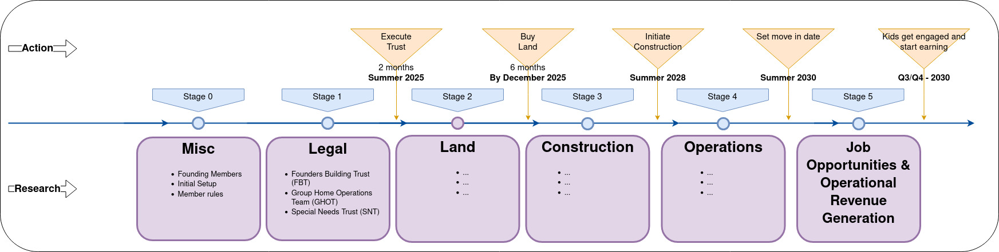

# Timeline and Dates

1.  Critical to set a timeline and work towards it.
2.  Once agreed upon, identify tasks that needs to be accomplished.
3.  Proactively gather information and take actions timely.

---
## Pictorial Representation of Project Timeline

---

[**Next ... Roles and Responsbilities of the Founding Member**](https://github.com/RameshBalasubramanian/SpecialNeedsHomeVA/blob/main/3%20-%20Founding%20Members/3-1-Founding-Builders-Trust-Roles.md)
