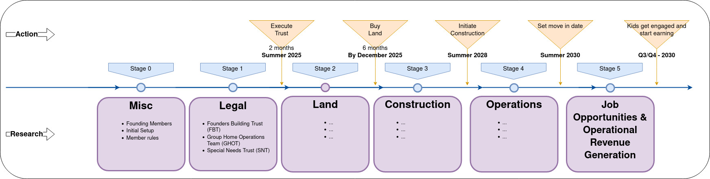

# Questions: That needs to be answered

## Capital and Seed Funding

1.  Estimate Lawyer Fees to setup the Trusts
2.  Estimate Funds capital costs for buying Land
3.  Estimate Construction Funding to the builder for building the group home
4.  Estimate Funds needed for initial setup of the Operational Trust

## Operational Funding

1.  Estimate Daily Operations cost (Ex: Groceries, etc.)
2.  Identify the Services needed in the facility
3.  Estiamte staffing needs and cost
4.  Estimate utility costs
5.  Estimate Building and Site Maintenance (HOA)
6.  Estimate Taxes

## Identify

1.  Identify few sites
2.  Identify few builders
3.  Identify few HOA companies

---
# Pictorial Representation of Project Timeline

---

# Tasks: That needs to be accomplished
## Next 6–8 Weeks

**Founders Building Trust (FBT)** - For responsible for infrastructure and legal aspects, and the \
**Group Home Operations Team (GHOT)** - For early-stage planning and operational frameworks.

| Area  | Workstream                     | Key Activity                                                                                         | Owner (TBD) | Target Completion Date |
|-------|-------------------------------|------------------------------------------------------------------------------------------------------|-------------|-------------------------|
| Misc| Founding Member | Identify the founding members                                 |  X |                         |
| Misc| Member Rules | Formulate the rules                                    | X |                         |
| Misc| Initial Setup | Seed money for inital work                                       | X |                         |
| Misc| Initial Setup | Identify other Homes to study and learn                                       |   |                         |
| Misc| Initial Setup | Make a call and identify the challenges; Document;                                       |   |                         |
| Legal| FBT  | Confirm zoning classification and engage zoning/planning consultant                                 |             |                         |
| Legal| FBT | Identify and evaluate potential property sites for acquisition                                       |             |                         |
| Legal| FBT | Schedule pre-application meeting with Fairfax County zoning staff                                    |             |                         |
| Legal| FBT | Schedule pre-application meeting with Fairfax County zoning staff                                    |             |                         |
| Legal| FBT | Begin feasibility study (zoning, land use, density, utilities)                                       |             |                         |
| Legal| FBT | Identify legal entity structure for the land trust                                                   |             |                         |
| Legal| FBT | Shortlist architects experienced with accessible housing                                              |             |                         |
| Legal| FBT | Initiate preliminary financial model for land and construction costs                                 |             |                         |
| Legal| FBT | Engage legal counsel for land acquisition and trust formation                                        |             |                         |
| Legal| FBT | Develop Phase 1 concept design and site layout plan                                                  |             |                         |
| Legal| FBT | Initiate conversations with lenders or financial backers                                             |             |                         |
| Legal| GHOT | Define dwelling unit types (studio, 1-BR, shared units, etc.) and occupancy models              |             |                         |
| Legal| GHOT | Outline essential shared amenities (kitchen, dining, recreation, therapy rooms)               |             |                         |
| Legal| GHOT | Identify minimum common services needed for adult residents (safety, health, engagement)      |             |                         |
| Legal| GHOT | Define early operational policies and roles for internal management                            |             |                         |
| Legal| GHOT | Explore on-site job types or microenterprise opportunities (e.g. packaging, crafts)            |             |                         |
| Legal| GHOT | Formulate framework for parent co-living in adjacent or nearby private homes                  |             |                         |
