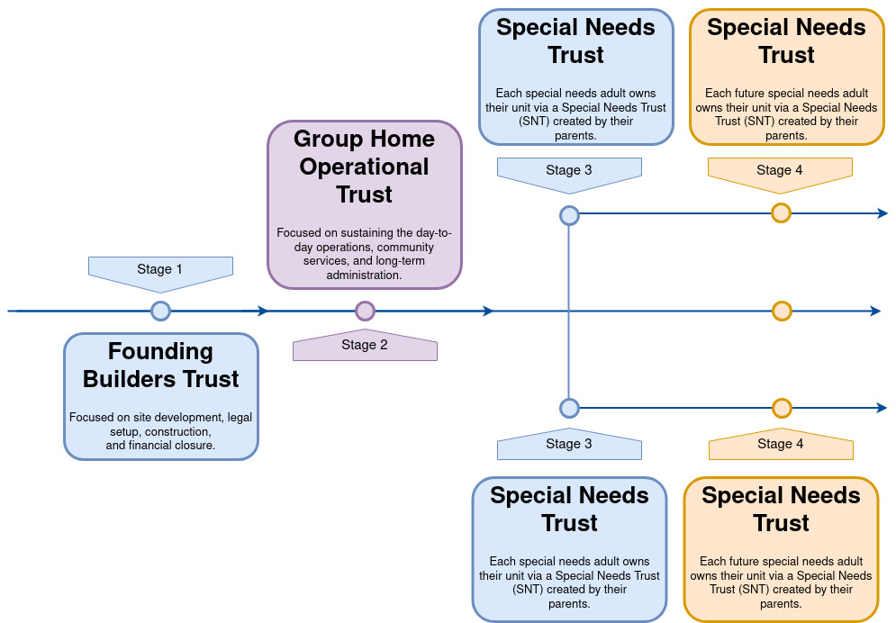
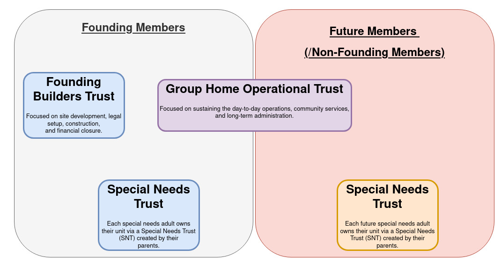

# Conceptual Initial Plan: Special Needs Community Group Home

# Overview

This plan outlines the creation of a Special Needs Community Group Home, governed by a Core Founding Parents Council, and structured into two distinct but interdependent workstreams:

1. **Founding Builders Trust (FBT):** Focused on site development, legal setup, construction, and financial closure.  
2. **Group Home Operational Trust (GHOT):** Focused on sustaining the day-to-day operations, community services, and long-term administration.
2. **Special Needs Trust (SNT):** Focused on providing financial support and security for individuals with disabilities while maintaining their eligibility for public benefits like Medicaid and Social Security. SNTs are designed to supplement, not replace, government assistance, ensuring that the beneficiary can maintain their quality of life without jeopardizing their access to crucial aid.

The model maintains strict delineation between individual ownership (via Special Needs Trusts) and shared services, ensuring both fiduciary clarity and sustainable community support.

# Pictorial Representation of Trust Sequence by Timeline

# Pictorial Representation of Founding/Future Members and Trust Relationship

# Pictorial Representation of Trust Funding Expenses

# 1. Founding Builders Trust (FBT)

**Purpose:**  
To establish, acquire, and build the community site and infrastructure. This trust is temporary and will dissolve after Phase 1 completion unless extended.

## Key Workstreams & Activities

### A. Property Acquisition & Legal Setup
- Identify and shortlist compliant sites  
- Conduct legal due diligence  
- Secure purchase agreements and register title under FBT  
- Engage legal counsel for trust formation and property law compliance  

### B. Financial Structuring
- Collect capital contributions from founding parents  
- Establish transparent accounting and banking systems  
- Create Phase 1 budget for land, construction, legal costs  
- Set clear financial close and distribution policies  

### C. Zoning, Permits & Compliance
- File zoning change applications as needed  
- Obtain environmental, ADA, and county construction permits  
- Ensure design meets special needs accessibility codes  

### D. Site Planning & Construction
- Engage licensed architects and contractors  
- Approve master site plan and building layouts  
- Oversee construction milestones  
- Obtain occupancy and inspection approvals  

### E. Transition & Dissolution
- Transfer unit titles to respective Special Needs Trusts  
- Establish long-term utility/service contracts  
- Complete final audits and dissolve trust  
- *Optional:* Extend into Phase 2 if required  

# 2. Group Home Operational Trust (GHOT)

**Purpose:**  
To manage and sustain daily operations, shared amenities, staffing, and administration of the community.

## Key Workstreams & Activities

### A. Governance & Administration
- Form Board from founding parents (with rotations)  
- Hire community administrator  
- Create bylaws, voting rights, and policy enforcement procedures  

### B. Service Design & Operations
- Community kitchen and meal preparation  
- Transport services (e.g., community van)  
- Medical coordination for basic checkups and emergencies  
- Infrastructure and utility maintenance  

### C. Finance & Sustainability
- Collect monthly service fees from residents  
- Maintain budget forecasts and reserves  
- Conduct annual financial reports  
- Apply cost-sharing models for operational longevity  

### D. Staffing & Care Coordination
- Recruit trained special needs support staff  
- Conduct background checks and onboarding  
- Enable coordination with private caregivers outside GHOT scope  

### E. Amenities & Enrichment
- Maintain recreational, sensory, and therapy spaces  
- Provide programming: fitness, hobby clubs, events  
- Partner with external nonprofits for group engagement  

# 3. Special Needs Trust

A Special Needs Trust (SNT) in Virginia is a legal arrangement that allows you to set aside assets for a person with a disability without impacting their eligibility for government benefits. It ensures the disabled person can benefit from the assets while maintaining access to programs like Supplemental Security Income (SSI) and Medicaid.

## Key Workstreams & Activities

### 1. Understanding SNT Types
- **First-party SNTs:** Funded by the beneficiary's own assets (e.g., inheritance, settlement).  
- **Third-party SNTs:** Funded by someone other than the beneficiary (e.g., parents, family).

### 2. Setting up the Trust
- Consult with an attorney specializing in special needs planning and elder law.  
- Determine the type of trust (first-party or third-party) and who will serve as trustee.  
- Clearly define the terms of the trust, including how funds will be used and distributed.

### 3. Funding the Trust
- For **first-party SNTs**, ensure assets are transferred to the trust according to regulations.  
- For **third-party SNTs**, determine the funding source and transfer assets accordingly.

### 4. Managing the Trust
- The trustee is responsible for managing the trust funds and ensuring they are used appropriately.  
- Distributions must be made for the benefit of the beneficiary and align with the trust's terms.  
- Maintain records of all transactions and communicate with the beneficiary and relevant parties.

### 5. Protecting Government Benefits
- Ensure the trust is structured in a way that does not jeopardize the beneficiary's eligibility for Medicaid or SSI.  
- Adhere to any Medicaid payback requirements for **first-party SNTs**.  
- Regularly review the trust and ensure it remains compliant with government regulations.

### 6. Beneficiary's Needs
- The trust should be designed to meet the beneficiary's specific needs, including healthcare, housing, education, and recreation.  
- Allow for flexibility in how funds are used to adapt to the beneficiary's changing needs over time.

### 7. Estate Planning
- Consider how the trust will be handled after the beneficiary's death, including any remaining assets.  
- In **third-party SNTs**, determine how the remaining assets will be distributed, either to descendants or other beneficiaries.

### 8. Working with Professionals
- Collaborate with attorneys, financial advisors, and other professionals to ensure the trust is properly established and managed.  
- Seek advice from organizations like *The Arc of Northern Virginia*, which offers trust services and guidance.

